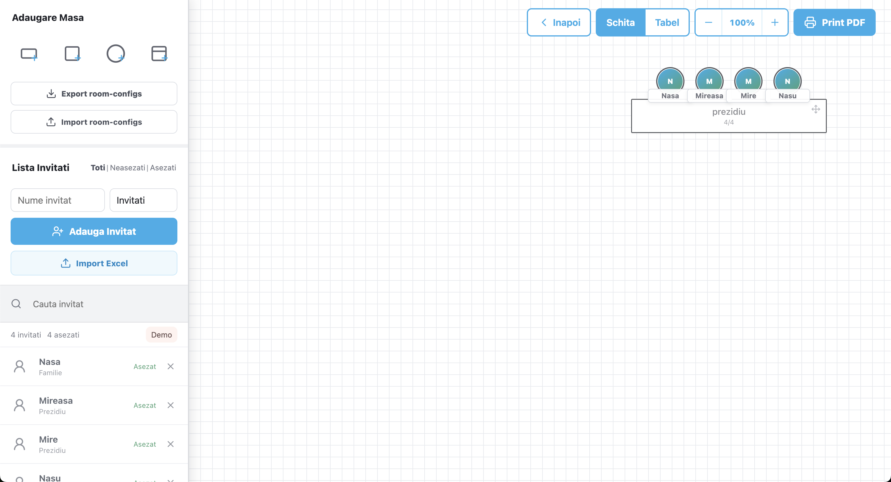
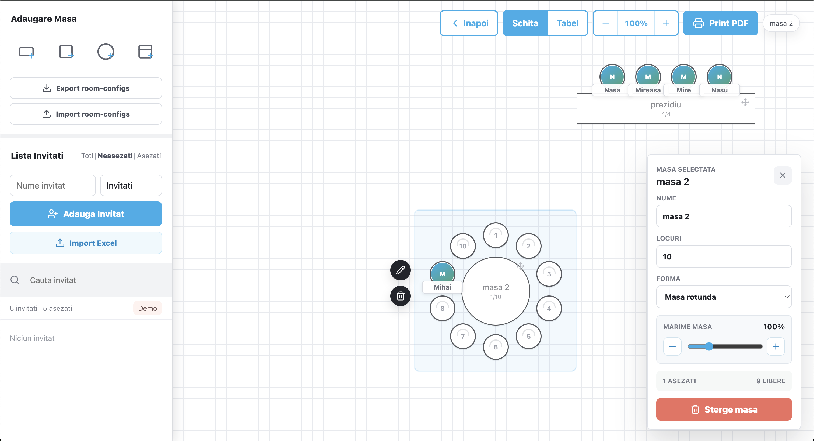

# Wedding Planner

## What It Does

Wedding Planner is a frontend-only web app for arranging wedding guests around tables on a visual room plan.



It lets you:

- Add round, square, rectangular, and prezidiu tables.
- Drag tables around a grid-based room layout.
- Add guests manually or import them from an Excel file.
- Drag guests into seats and move them between seats.
- Right-click seated guests to edit their name or remove them from a table.
- Resize individual tables while keeping guest circles readable.
- Zoom and pan the room canvas, similar to a whiteboard tool.
- Switch between visual sketch view and table/list view.
- Export and import full room configurations as JSON.
- Save work automatically in `localStorage`.
- Print the current plan as PDF from the browser.



## How To Start Locally

Install dependencies:

```bash
npm install
```

Start the local development server:

```bash
npm run dev
```

Open the URL shown by Vite, usually:

```text
http://localhost:5173/
```

Build for production:

```bash
npm run build
```

Preview the production build:

```bash
npm run preview
```
